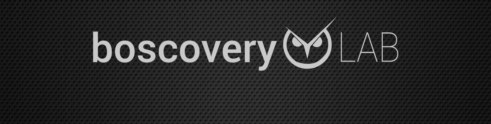

# Proyecto BoscoverySAT

### Descripción.

Este repositorio contiene el esquema electrónico así como el diseño de placa PCB para la implementación de un preamplificador LNB.

### Contenido del repositorio.

El presente repositorio está dividido en los siguientes directorios:

* [eagle](eagle/) - Contiene el proyecto donde se ha diseñado el esquema de circuito y se ha creado el PCB.
* [docs](docs/) - Contiene información adicional del proyecto como listado de componentes o fotolito del PCB.
* img - Esta carpeta contiene imágenes propias de la configuración del repositorio.

### Características del diseño.

El proyecto de esquema y placa PCB ha sido realizado mediante la aplicación [Cadsoft Eagle 6.5.0](http://www.cadsoftusa.com/download-eagle/).

### Contacto.

Para cualquier duda o contacto que desee realizar, por favor, remita un correo electrónico a la siguiente dirección: [boscoverylab@gmail.com](boscoverylab@gmail.com) y nos pondremos en contacto con usted a la mayor brevedad.

Si lo desea, también puede contactar con nosotros a través de nuestra cuenta de Twitter [@boscoverylab](https://www.twitter.com/boscoverylab).

### Licenciamiento.

Cualquier producto, marca comercial o nombre corporativo empleado en el contenido del presente repositorio, se ha usado con el objetivo de identificar y/o explicar conceptos, sin intención alguna de infringir los términos de uso y/o licencias de los mismos.

El presente documento se distribuye en cualquiera de sus formatos, bajo la licencia internacional [Reconocimiento-NoComercial-CompartirIgual 4.0 Internacional de Creative Commons](http://creativecommons.org/licenses/by-nc-sa/4.0/), no estando autorizada la reclamación de ningún derecho ni cantidad económica alguna en nombre de su autor o autores, a ninguna Entidad de Derechos de Autor, tanto española como internacional.

